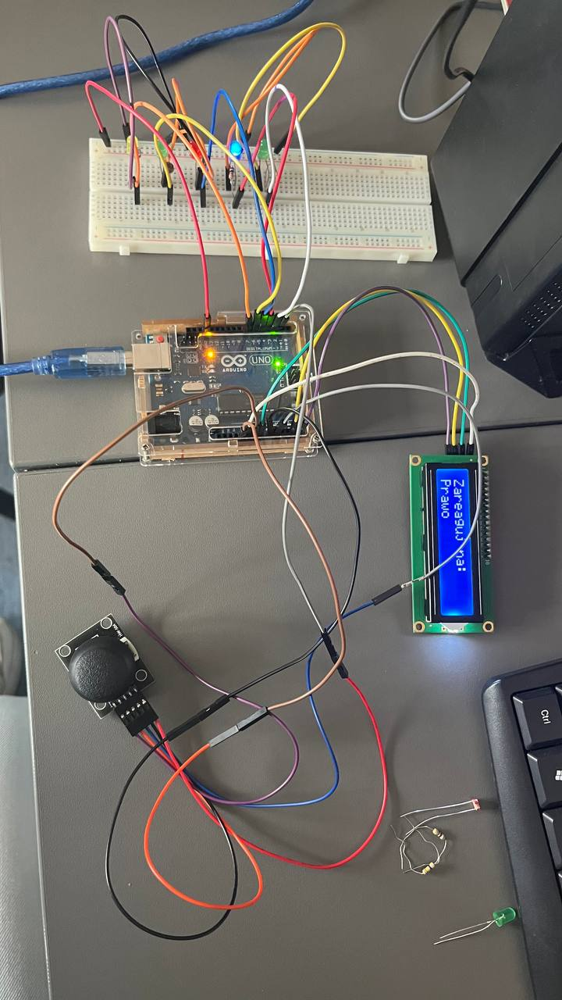
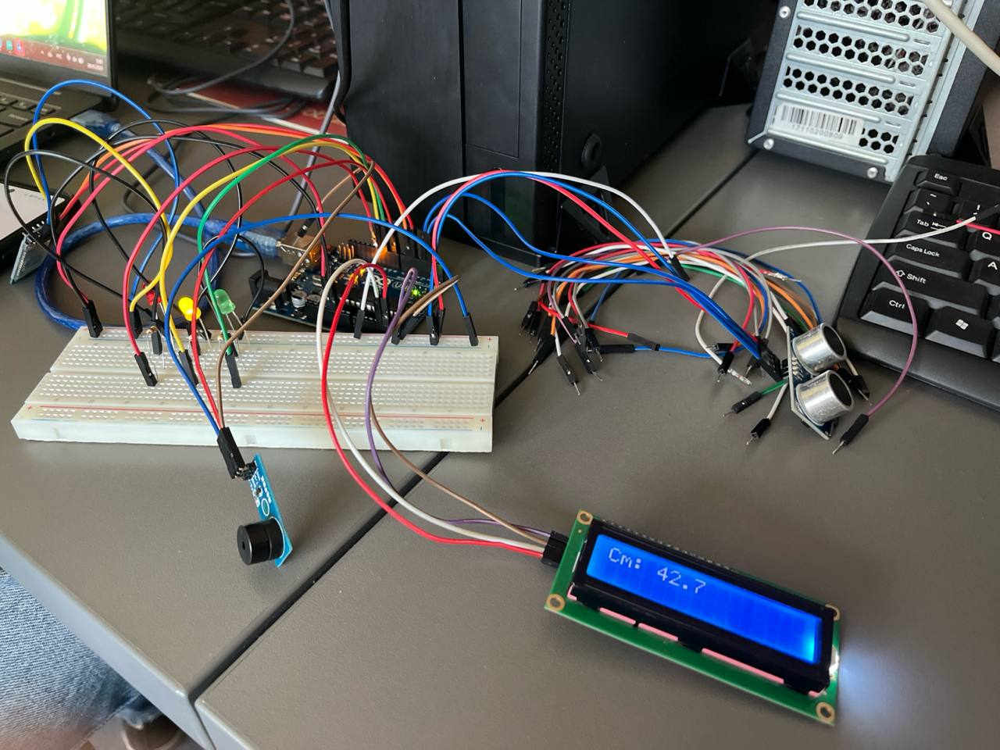
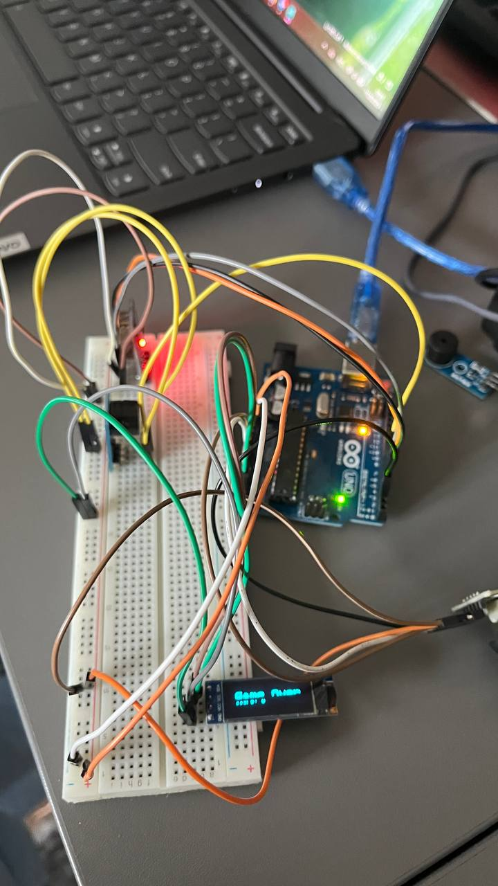

# 🎓 Arduino University Projects

These are simple university-level IoT exercises, but I enjoyed building them on real hardware and understanding microcontroller logic.

## 🗂️ Project List

| Folder               | Title                                                                   |
|----------------------|-------------------------------------------------------------------------|
| `/lab1`              | Two-Way Traffic Light Controller                                        |
| `/lab2`              | Temperature Monitor                                                     |
| `/lab3`              | Reflex Game                                                             |
| `/lab4`              | Ultrasonic Distance Alert System                                        |
| `/lab5`              | Environmental Monitor                                                   |
| `/lab6`              | Snake Game                                                              |

## Projects description

### Two-Way Traffic Light Controller
This project simulates a two-direction traffic light system using an Arduino. Each side (West and East) has a red, yellow, and green LED, along with a pedestrian (or vehicle) button.

#### How It Works
1. At startup, West has green light, East has red.

2. When a button is pressed on the red-light side, a transition is triggered:

3. The green light on the active side turns yellow (warning).

4. Then it turns red.

5. The requesting side gets yellow, then green.

6. While a transition is in progress, other button presses are ignored.

---

### Temperature Monitor with LCD & LEDs
This project uses an NTC thermistor to measure ambient temperature and displays it on an I2C LCD screen. It also uses three LEDs (red, green, blue) to visually indicate the current temperature range.

#### How It Works
Reads analog temperature data from a thermistor.

1. Calculates the temperature in Celsius using the Steinhart–Hart equation.

2. Displays the value on an LCD (16×2).

Lights up:

- 🔵 Blue LED if it's too cold (below 16°C),

- 🟢 Green LED if the temperature is just right (between 16°C and 27°C),

- 🔴 Red LED if it's too hot (above 27°C).

---

### Reflex Game with Joystick & LCD
Test your reaction speed using a joystick and LEDs! This fun and simple game lights up a direction, and you must move the joystick (or press its button) in the correct direction within 2 seconds. The faster and more accurate you are — the higher your score!

#### How It Works
1. A random direction is selected (Left, Right, Up, Down, or Center).

2. Corresponding LED lights up, and the LCD screen shows the direction.

3. You have 2 seconds to react using the joystick or press the button.

4. If you respond correctly, you gain 1 point.

5. The current score is then shown before the next round.

---

### Ultrasonic Distance Alert System with LCD, LEDs & Buzzer
A simple yet practical Arduino-based project that measures the distance using an ultrasonic sensor and provides real-time feedback through an LCD display, LED indicators, and a buzzer for proximity alerts.

#### How It Works
1. The HC-SR04 sensor measures the distance to an object.

2. The result is shown on the LCD display in centimeters.

3. Based on the measured distance, the system reacts as follows:

| Distance  	| LED	    | Buzzer    | LCD Message               | 
|---------------|-----------|-----------|---------------------------|
| > 80 cm	    | Green	    | Off       | Safe distance             |
| 40 – 80 cm	| Yellow	| Off	    | Caution                   |
| < 40 cm	    | Red	    | Beeping	| "WARNING! Too close!"     |

Data is also printed to the Serial Monitor for debugging/logging.

---

### Environmental Monitor with DHT22 & Photoresistor
This project monitors temperature, humidity, and light intensity using a DHT22 sensor and a photoresistor. The readings are displayed on a 16x2 I2C LCD display, and three LEDs indicate environmental status: green (normal), yellow (warning), and red (alert).

#### How It Works
1. Reads temperature and humidity from the DHT22 sensor.

2. Measures ambient light using a photoresistor; the value is roughly mapped to lux.

3. Evaluates environmental conditions:

✅ Green: All values within normal range.

⚠️ Yellow: Approaching critical thresholds.

🔴 Red: Values outside safe ranges.

4. Displays real-time data on the LCD:

First row: Temperature (°C) and Humidity (%)

Second row: Light (lux)

5. Lights up LEDs based on the most critical parameter:

Green = Normal

Yellow = Warning

Red = Alert

---

### Snake Game on OLED Display
A simple Snake Game implemented on an Arduino with an SSD1306 OLED screen, joystick control, and buzzer feedback for eating food and game over events.

#### How It Works
1. The snake starts in the center of the screen with a fixed initial size.

2. A piece of food is randomly placed on the screen.

3. You control the snake’s direction by moving the joystick: up, down, left, or right.

4. The snake moves forward automatically, and its body follows the head.

5. If the snake’s head reaches the food, the snake grows, the score increases, and a new food piece appears.

6. If the snake hits the wall or itself, the game ends and a “Game Over” sound plays.

7. You can pause or resume the game by pressing the joystick button.

8. The OLED display constantly updates to show the snake, food, and current score.

